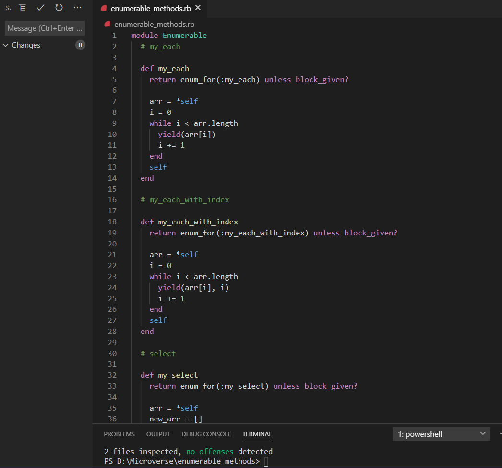

# Enumerable-Methods

This project is a microverse collaborative project which is part of the requirements of the microverse technical curriculum in the Ruby section.
This project consist of different ruby enumerable methods that emulate Ruby's in-built enumerable methods



<h3>Methods <a name = "method"></a></h3>
<h4>The custom methods created are listed below:</h4>
<li>my_each</li>
<li>my_each_with_index</li>
<li>my_select</li>
<li>my_all?</li>
<li>my_any</li>
<li>my_none?</li>
<li>my_count</li>
<li>my_map</li>
<li>my_inject</li>

## Built With

- Ruby
- VS code

## Getting Started

**Run the code demonstrations below**

```bash
ruby enumerable.rb
```

### Prerequisites

- Ruby

## Setup

To run this project locally, please ensure you have Ruby installed on your machine, then clone this repository by running.

```bash
git clone https://github.com/marcode95/enumerable_methods/tree/feature
```

After cloning run

```bash
cd enumerable-methods
```

Lastly run either of the commands listed in the getting started section above.

## Authors

👤 **Marco Erhardt**

- Github: [@marcode95](https://github.com/marcode95)

👤 **Abhigyan Mahanta**

- Github: [@abhigyan001](https://github.com/abhigyan001)

## 🤝 Contributing

Contributions, issues, and feature requests are welcome!

## Show your support

Give a ⭐️ if you like this project!

## Acknowledgments

- Hat tip to anyone whose code was used
- Inspiration
- etc

## 📝 License

This project is a collaboration project of microverse students. All rights are reserved for Marco and Abhigyan.
